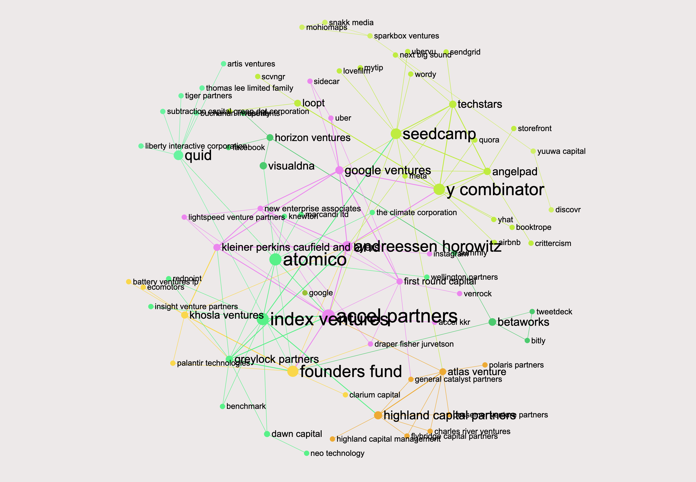

A few weeks ago, I read an [interesting tweet](https://twitter.com/VitalikButerin/status/1229888976212779009) by Vitalik Buterin, the founder of Etherium, that was retweeted by Naval Ravikant.

> Capitalism predicated on capturing network effects has bad incentives. Becoming the center of the connection graph lets you capture lots of value, often too much, and just being a node gives you almost nothing. This of course leads to everyone trying and failing at the former.

Now I wonder if this abstraction is just fancy terminology like the usage of computer science or graph theory terms in casual conversation or if there is a more valuable insight in the _backend_. Let's _double click on this_.

## Elaboration

### Framework

On Shane Parrish's the [Knowledge Project](https://fs.blog/knowledge-project/mike-maples/) Mike Maples described markets as something that can't be mapped geographically. Searching for gaps in today's market is fruitless because chances are others have tried them. Time-travels, however, use brave bets on future needs and probabilistic insight about adoption.

That is where graph analysis could come in. It can find latent connections and compute complex relationships between past technology adoption behavior and current tech developments and combine those with existing market networks.

The gaps identified in this way are colled structural holes.

On a different _node_, there is also [research examined the relationships of structural holes](<https://timreview.ca/article/828#:~:text=In%20a%20new%20venture%2C%20an,of%20knowledge%20and%20resource%20gathering.&text=When%20an%20entrepreneur%20acts%20as,hole%20(Burt%2C%202000).>) on venture development which found that they provided ventures with a diverse source of knowledge and information. But it was also found that they may hinder the development and riks exposure of proprietary research in research-heavy projects.

### Platforms

Platforms like Etherium or Amazon in this framework might be represented by a cluster of nodes or one big node, e.g. [Aggregation Node](link_generated_on_download). But those clusters are not alike. The former's equity distribution is much more spread between its nodes e.g. shareholders and partners.

In the tweet mentioned above of Buterin, he is advocating platforms whose clusterings resemble the structure of Etherium. I've written about these types of clusters [here](/blog/decentralized-autonomous-organizations-in-open-source).

## Consequences

A graph analysis tool that visualizes industries, problems and technologies as nodes of a graph could be useful to find promising vertices to invest or to evaluate investments.

For venture capitalists and entrepreneurs, this could be particularly useful.

In specific fields, this type of analysis is already a common practice. In text-content-creation, this process is Called _text Mining_ and _Topic Modelling_. Its goal is to find topics to link (which I am doing by writing this piece of text) and creating a valuable contribution.

<!-- I originally wrote this on RemNote.io, a startup I am building. To read the RemNote version click [here](). -->
