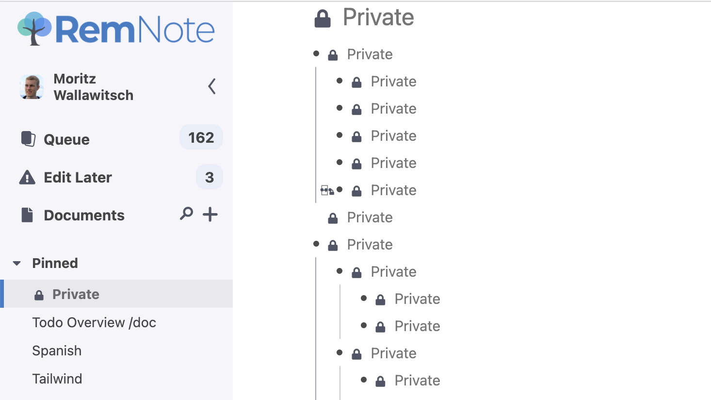
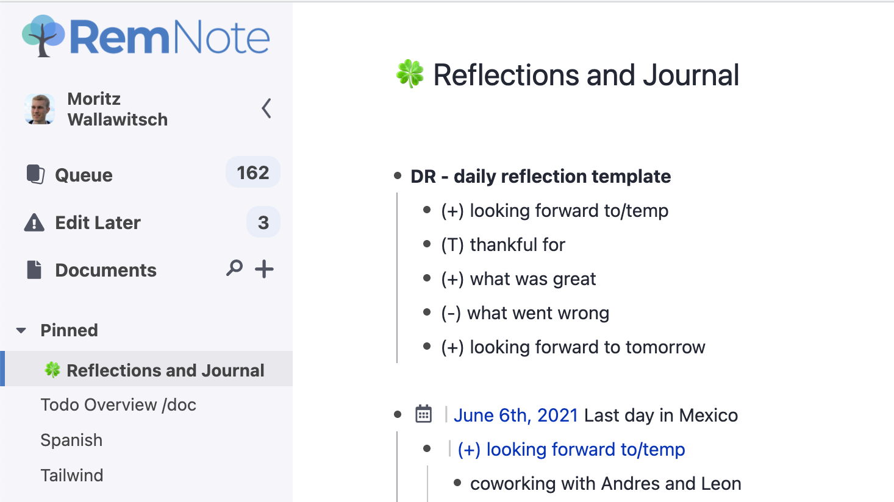

# Tool adoption and value creation

Networked note-taking tools [augment our cognition](https://moritz.digital/cas) by enabling us to work with an extended corpus of knowledge. These applications have seen a substantial increase in adoption in the last few years that can be projected to continue.

Collaborative Networked note-taking tools will allow for an even greater collaboration because they enable us to leverage not only our own extended brains but that of that of our peers and close collaborators.

Similar to a discussion forum, but far more powerful, thoße tools amplify the [collective intelligence](https://en.wikipedia.org/wiki/Collective_intelligence) of it's user.

# The Puzzle

Knowledge Graph collaboration sounds like a straightforward feature to implement. However, the complexity of collaborating on a graph is magnitudes more complex than that of a single document. To summarize, there are many problems and puzzles to be solved until this value is unlocked..

## Private and non-private

When sharing your knowledge base with a close collaborator, you want to make sure nothing private is shared. Many people use their personal note-taking system also as their journal, writing about the most intimate and cherished experiences. A requirement, therefore, is that the system has a function to differentiate between non-private and private notes that a coworker should not be able to read or search for.

<blockquote class="twitter-tweet">
Generating topics is one way to build a personal wiki. Could also ask questions to your wiki with <a href="https://twitter.com/HebbiaAI?ref_src=twsrc%5Etfw">@HebbiaAI</a>   Sharing knowledge graphs is the dream. Difficulty is permissions and public/private boundaries <a href="https://t.co/4Spx4t7Xan">https://t.co/4Spx4t7Xan</a>
&mdash; Athens 🏛 is hiring Clojure(Script) Devs (@AthensResearch) <a href="https://twitter.com/AthensResearch/status/1348486878983458817?ref_src=twsrc%5Etfw">January 11, 2021</a></blockquote>

RemNote already integrates a privacy feature, although its **shared knowledge base** feature is still in private beta.

## Irrelevant sharing and cluttering

We also want to prevent that our coworker's search is cluttered by irrelevant notes (for example, about his cake recipes). We, therefore, need a mechanism to share only a specific work-related part of the graph without hiding useful parts of it.

## classification aided sharing

The complexity of differentiating those attributes of a graph's nodes increases exponentially with the number of nodes and their connectivity. Therefore, a simpler and more intelligent solution needs to be found.

## Entity merging

The second problem lies in merging the entities of the graph. For example, two physics researchers sharing their knowledge bases to collaborate on a paper might both have a note about, say, [Fourier transformation](https://en.wikipedia.org/wiki/Fourier_transform), and they are close to identical. To reduce the complexity of this collaboration, we now want to merge these two note-entities.

This problem is well known by tech, like Amazon and Google. Their technologies are built on knowledge graphs and are actively working on improving those systems. "Entity alignment is the key step towards knowledge graph integration from multiple sources," as researchers by Amazon noted in a [paper published in 2020](https://www.amazon.science/blog/combining-knowledge-graphs-quickly-and-accurately).
RemNote Concept descriptor framework allows for a much easier graph integration. It's an optional feature and framework that suggests writing your notes in a semantic structure separating concepts (entities) and descriptors (attributes). Those can be detected, compared, and merged because they represent the same concept and follow a specific structure.

## Read and write access

Another puzzle is the editing of our collaborator's notes. In many cases, we prefer them not to edit our notes but only to read them. For example, we might have a note or reference in our Fourier transformation document that only we can make sense of and understand. The collaborator seeing this illogical note might delete it.
conclusion

## Rule vs. Learning system

We've seen that many of the puzzles involve classification and setting boundaries. The manual process of sharing or hiding specific documents could be aided or substituted by an algorithm that classifies a users' knowledge base entities by context and category.

The company that solves the collaborative graph collaboration puzzle first will capture a significant portion of the market and gain a strong first-mover advantage. Exciting times.
